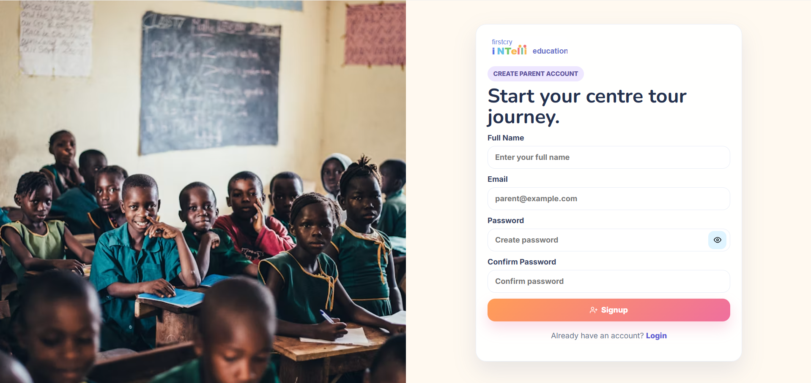
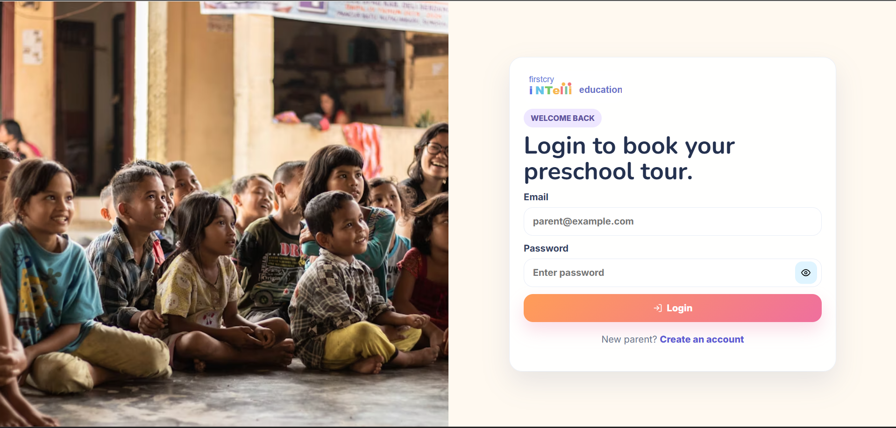
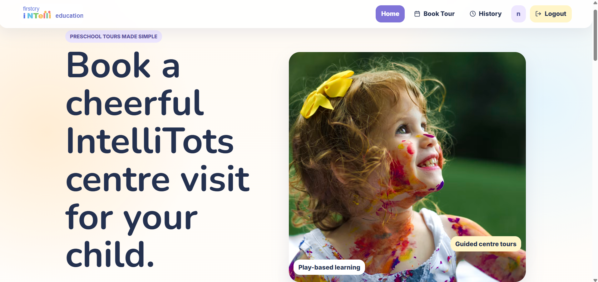
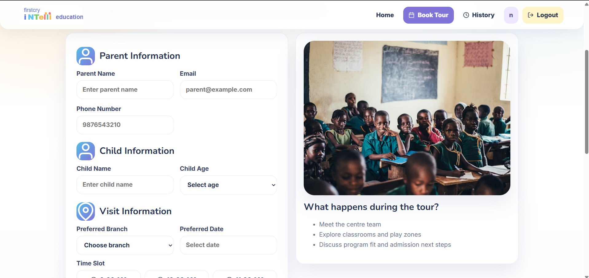
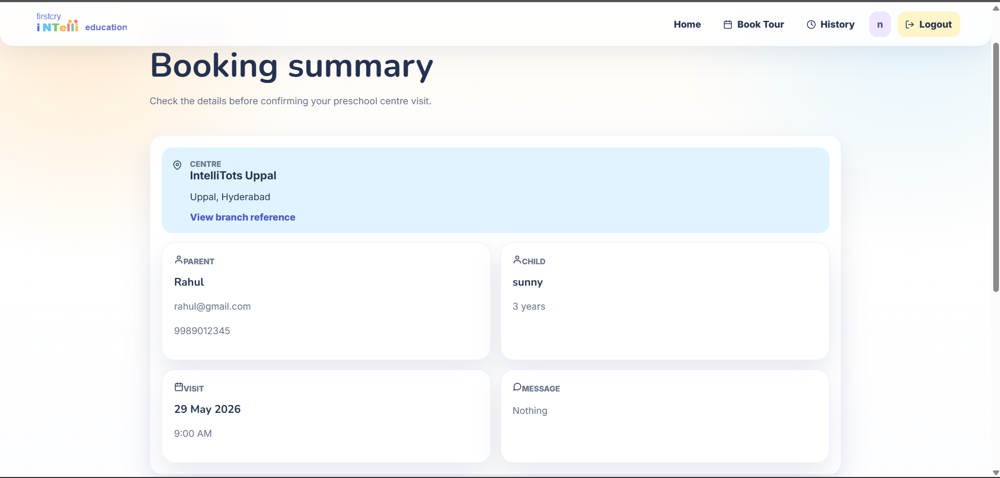
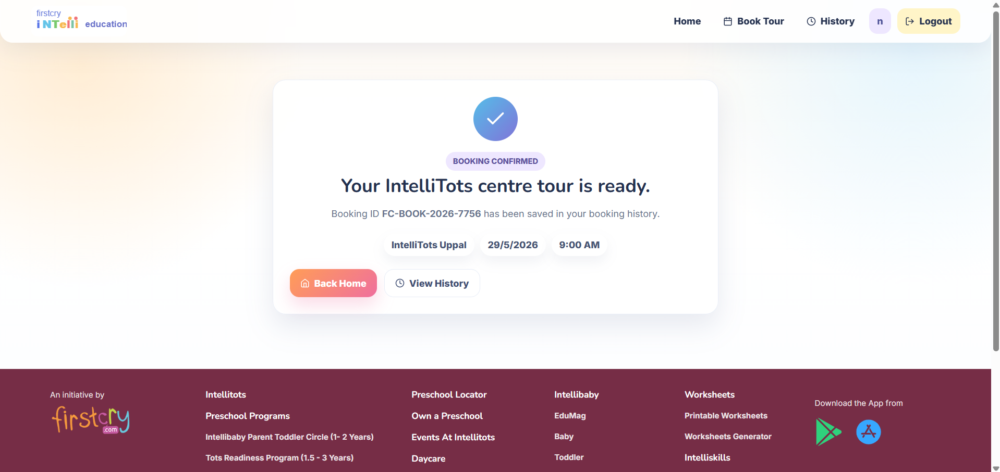
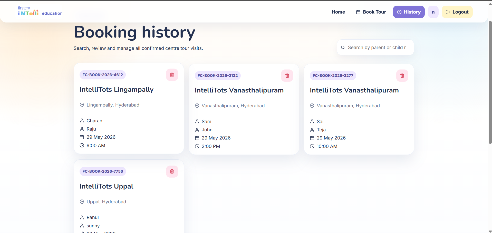

# 🎓 FirstCry IntelliTots – Centre Tour Booking Calendar

A modern, responsive, child-friendly, and professional preschool centre tour booking platform inspired by the **FirstCry IntelliTots Preschool ecosystem**.

This project was built as a **Frontend Developer Internship Prototype** using **React JS** and focuses on clean UI/UX, responsive design, frontend authentication, booking workflows, and LocalStorage-based data persistence.

---

# 🌐 Live Demo

> Add your deployed link here  
>  `https://Tour-Booking.vercel.app`

---

# 📂 GitHub Repository

> Add your GitHub repository link here
> https://allemsamyel-03.github.io/Tour-Booking/

---

# 📌 Project Overview

Parents can:

- Sign up and log in
- Explore preschool information
- Book a preschool centre tour
- Select preferred branch, date, and time slot
- Receive booking confirmation
- View booking history
- Search bookings by parent or child name

The application simulates a realistic preschool admission enquiry and booking workflow without requiring a backend.

---

# ✨ Features

## 🔐 Authentication

- Signup page
- Login page
- Logout functionality
- Protected routes
- Persistent login using LocalStorage
- Password validation
- Show/Hide password

---

## 🏫 Preschool Tour Booking

- Select preferred IntelliTots branch
- Date picker for booking
- Time slot selection
- Form validation
- Booking summary page
- Booking confirmation screen
- Auto-generated Booking ID

---

## 📜 Booking History

- View all previous bookings
- Search by:
  - Parent Name
  - Child Name
- Delete booking functionality
- Empty state UI

---

## 🎨 UI/UX Features

- Child-friendly but professional UI
- Responsive design for:
  - Mobile
  - Tablet
  - Desktop
- Soft preschool-themed colors
- Smooth animations using Framer Motion
- Hover effects & transitions
- Clean spacing and typography

---

## ⚡ Performance Features

- LocalStorage data persistence
- Lazy loading
- Reusable React components
- Optimized rendering
- Responsive layouts using Flexbox & CSS Grid

---

# 🛠️ Tech Stack

| Technology        | Usage               |
| ----------------- | ------------------- |
| React JS          | Frontend Framework  |
| CSS / CSS Modules | Styling             |
| React Router DOM  | Routing             |
| Framer Motion     | Animations          |
| React DatePicker  | Date Selection      |
| React Icons       | Icons               |
| React Toastify    | Toast Notifications |
| LocalStorage      | Data Persistence    |

---

# 🏢 IntelliTots Branches Included

- IntelliTots Narapally
- IntelliTots Lingampally
- IntelliTots Kothapet
- IntelliTots Kaziguda
- IntelliTots Hayathnagar
- IntelliTots Vanasthalipuram
- IntelliTots Madhapur
- IntelliTots Uppal
- IntelliTots Himayatnagar
- IntelliTots LB Nagar

---

# 📱 Responsive Design

The project is fully responsive and optimized for:

✅ Mobile Devices  
✅ Tablets  
✅ Desktop Screens

Responsive techniques used:

- Flexbox
- CSS Grid
- Media Queries
- Mobile-first layouts

---

# 📁 Folder Structure

```bash
src/
 ├── components/
 │    ├── Navbar/
 │    ├── Footer/
 │    ├── Hero/
 │    ├── BookingForm/
 │    ├── TimeSlots/
 │    ├── SummaryCard/
 │    ├── Testimonials/
 │    ├── FAQ/
 │    ├── ProtectedRoute/
 │    ├── SearchBar/
 │    └── BookingHistory/
 │
 ├── pages/
 │    ├── Login/
 │    ├── Signup/
 │    ├── Home/
 │    ├── Booking/
 │    ├── Summary/
 │    ├── Confirmation/
 │    └── History/
 │
 ├── styles/
 │
 ├── hooks/
 │    └── useLocalStorage.js
 │
 ├── utils/
 │    ├── generateBookingId.js
 │    ├── slotUtils.js
 │    └── validation.js
 │
 ├── assets/
 │
 ├── context/
 │    └── AuthContext.js
 │
 └── App.jsx
```

---

# 🔑 Authentication Flow

```text
Signup
   ↓
Login
   ↓
Store User in LocalStorage
   ↓
Access Protected Routes
```

Protected Pages:

- Booking Page
- Summary Page
- Confirmation Page
- Booking History Page

---

# 🗂️ LocalStorage Data

The project stores:

- Registered users
- Logged-in user
- Booking history
- Selected time slots
- Booking details
- Dark mode preference

---

# 🎯 Key Learning Outcomes

This project demonstrates:

- React component architecture
- React Hooks
- Form handling & validation
- Protected routing
- LocalStorage authentication
- Responsive frontend development
- UI/UX design principles
- State management
- Reusable components
- Professional frontend workflow

---

# 🚀 Installation & Setup

## 1️⃣ Clone the Repository

```bash
git clone https://github.com/AllemSamyel-03/Tour-Booking.git
```

---

## 2️⃣ Navigate to Project Folder

```bash
cd booking
```

---

## 3️⃣ Install Dependencies

```bash
npm install
```

---

## 4️⃣ Start Development Server

```bash
npm run dev
```

---

# 📦 Dependencies

Install required packages:

```bash
npm install react-router-dom
npm install framer-motion
npm install react-datepicker
npm install react-icons
npm install react-toastify
```

---

# 🌟 Future Improvements

Possible future enhancements:

- Backend integration
- Real-time slot availability
- Email notifications
- Firebase authentication
- Admin dashboard
- Online appointment management
- Payment integration

---

# 📸 Screenshots

> Add screenshots of:

- Login/Signup Pages
  
  

- Home Page
  
- Booking Page
  
- Booking Summary
  
- Confirmation Page
  
- Booking History
  

---

# 👨‍💻 Author

**Allem Samyel**

- GitHub: https://github.com/AllemSamyel-03
- LinkedIn: https://www.linkedin.com/in/allem-samyel-039655374/

---

# 📄 License

This project is created for educational and internship demonstration purposes.

---

# ⭐ Acknowledgements

Inspired by:

- FirstCry IntelliTots Preschool
- React JS Community
- Frontend UI/UX best practices

---

# 💡 Internship Focus

This project was designed to showcase:

✅ Responsive Design  
✅ React JS Skills  
✅ Clean UI/UX  
✅ Authentication Flow  
✅ LocalStorage Management  
✅ Booking Workflow  
✅ Professional Frontend Structure

Suitable for:

- Frontend Developer Internship
- React JS Internship
- UI Developer Internship
- Web Development Internship
